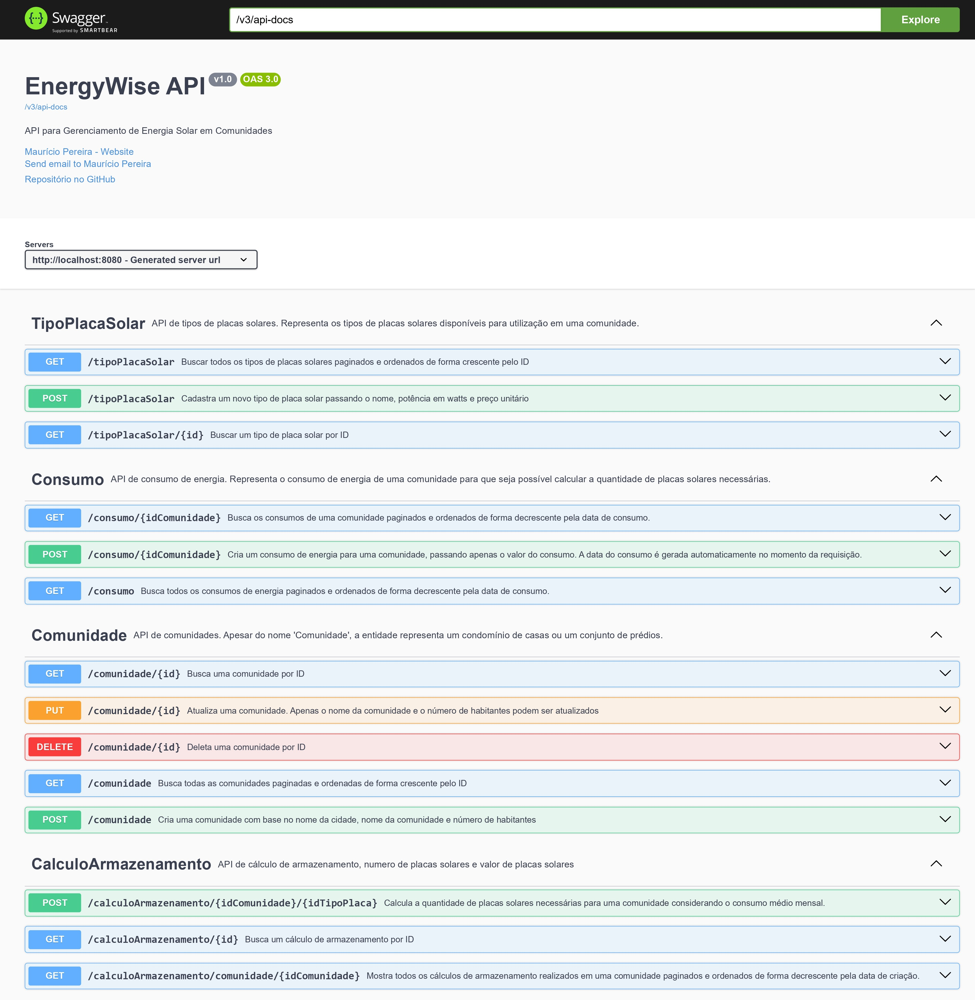
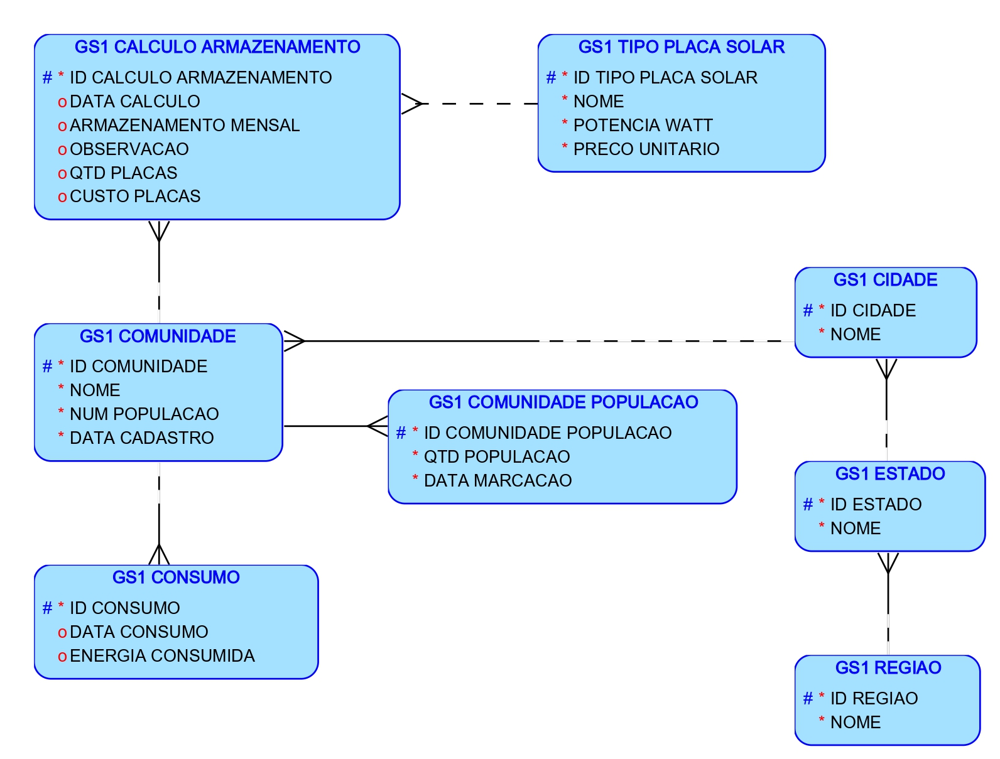
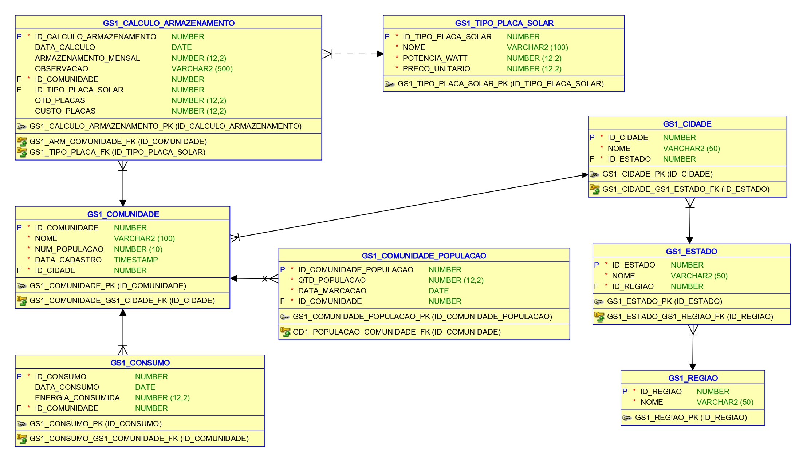

# EnergyWise

## Descrição do Sistema

O **EnergyWise** é um sistema desenvolvido para gerenciar o consumo de energia solar em comunidades e condomínios. O principal objetivo é auxiliar na transição para fontes de energia renováveis, permitindo que comunidades monitorem seu consumo energético e calculem a quantidade necessária de placas solares para atender às suas necessidades.  

O cálculo da quantidade de placas solares é feito com base no consumo médio da comunidade e no tipo de placa solar selecionado, considerando a potência, o preço unitário e uma margem de segurança de 20 por cento para garantir a eficiência do sistema.
O sistema também permite o cadastro de diferentes tipos de placas solares, para que os usuários possam comparar e escolher a melhor opção para suas necessidades.  

O principal ponto é que as placas solares tem tamanhos físicos semelhantes, mas com potências diferentes, e o sistema calcula a quantidade necessária de placas com base na potência e no consumo médio da comunidade. Placas solares com maior potência geram mais energia, mas também são mais caras, então o sistema ajuda a encontrar o equilíbrio ideal entre custo e benefício. 

Um documento PDF com uma descrição detalhada da solução pode ser encontrado [aqui](doc/energywise.pdf).
### Funcionalidades Principais

- **Gerenciamento de Comunidades**: Cadastro, consulta, atualização e exclusão de comunidades.
- **Registro de Consumo**: Registro e consulta do consumo de energia das comunidades.
- **Cálculo de Armazenamento**: Cálculo da quantidade necessária de placas solares com base no consumo médio e no tipo de placa selecionado.
- **Gerenciamento de Tipos de Placas Solares**: Cadastro e consulta de diferentes tipos de placas solares disponíveis.
- **Documentação e Testes via Swagger**: A API está documentada e pode ser testada utilizando o Swagger UI.

### Arquitetura do Sistema

O sistema foi desenvolvido utilizando o framework **Spring Boot**, seguindo a arquitetura MVC (Model-View-Controller). A aplicação é estruturada nos seguintes componentes:

- **Models**: Entidades que representam as tabelas do banco de dados.
- **Repositories**: Interfaces para operações de persistência.
- **Services**: Classes que contêm a lógica de negócio.
- **Controllers**: Endpoints REST que expõem a funcionalidade da aplicação.
- **DTOs**: Objetos de Transferência de Dados utilizados para comunicação entre as camadas.
- **Configurações**: Classes de configuração, como `ModelMapperConfig` e `OpenApiConfig`.

### Tecnologias Utilizadas

- **Java 21**
- **Spring Boot**
- **Gradle** (para gerenciamento de dependências e build)
- **Hibernate** (JPA)
- **Swagger/OpenAPI** (para documentação da API)
- **Banco de Dados Oracle** (ou outro banco de dados relacional)
- **ModelMapper** (para mapeamento de objetos)
- **Lombok** (para redução de código boilerplate)

## Imagens
**Capturas de Tela do Swagger UI**: Ilustra a documentação interativa da API.


## Modelagem do Banco de Dados
**ML do banco de dados Oracle**


**MR do banco de dados Oracle**
"

## Como Começar

### Pré-requisitos

- **Java 21** ou superior
- **Gradle**
- **Banco de Dados Oracle** (ou ajustar para outro banco de dados)
- **Postman** (para testes manuais da API)
- **Navegador Web** (para acessar o Swagger UI)

### Instalação

1. **Clone o repositório:**

   ```bash
   git clone https://github.com/Mauricio-Pereira/EnergyWise.git
   ```

2. **Navegue até o diretório do projeto:**

   ```bash
   cd EnergyWise
   ```

3. **Configure o arquivo `application.properties` com as credenciais do seu banco de dados.**

4. **Compile e execute a aplicação:**

   ```bash
   gradle bootRun
   ```

### Executando a Aplicação

A aplicação estará disponível em `http://localhost:8080`.

- **URL Base:** `http://191.234.176.144:8080`

## Documentação da API

A documentação interativa da API está disponível via Swagger UI.

- **Acesse**: `http://localhost:8080/swagger-ui/index.html`

## Endpoints da API

A seguir está uma tabela com os principais endpoints que utilizam stored procedures, incluindo o método HTTP, endpoint, descrição e o corpo da requisição (quando aplicável).

| Método com Procedure | Endpoint                                                 | Descrição                                                                                                              | Corpo da Requisição     |
|----------------------|----------------------------------------------------------|------------------------------------------------------------------------------------------------------------------------|-------------------------|
| **POST**             | `/comunidade`                                            | Cria uma nova comunidade com validação e inserção via procedure no banco de dados                                      | JSON (ver abaixo)       |
| **POST**             | `/consumo/{idComunidade}`                                | Registra um novo consumo de energia para uma comunidade utilizando procedure                                           | JSON (ver abaixo)       |
| **POST**             | `/tipoPlacaSolar`                                        | Cadastra um novo tipo de placa solar através de procedure                                                              | JSON (ver abaixo)       |
| **POST**             | `/calculoArmazenamento/{idComunidade}/{idTipoPlaca}`     | Realiza o cálculo de placas necessárias utilizando procedure e registra no banco de dados                              | -                       |
| **PUT**              | `/comunidade/{id}`                                       | Atualiza as informações de uma comunidade por ID (sem procedure)                                                       | JSON (ver abaixo)       |
| **DELETE**           | `/comunidade/{id}`                                       | Deleta uma comunidade específica por ID (sem procedure)                                                                | -                       |
| **GET**              | `/comunidade`                                            | Lista todas as comunidades cadastradas (paginação disponível)                                                          | -                       |
| **GET**              | `/consumo`                                               | Lista todos os consumos registrados (paginação disponível)                                                             | -                       |
| **GET**              | `/consumo/{idComunidade}`                                | Lista os consumos de uma comunidade específica (paginação disponível)                                                  | -                       |
| **GET**              | `/tipoPlacaSolar`                                        | Lista todos os tipos de placas solares cadastrados (paginação disponível)                                              | -                       |
| **GET**              | `/calculoArmazenamento/comunidade/{idComunidade}`        | Lista os cálculos de armazenamento de uma comunidade específica (paginação disponível)                                 | -                       |
| **GET**              | `/calculoArmazenamento/{id}`                             | Busca um cálculo de armazenamento específico por ID                                                                    | -                       |

## Exemplos de Testes 
JSON para CRUD - Utilize o swagger para testar, já que é utilizado paginação. 
Caso queira testar via Postman, utilize o JSON abaixo, mas inclua a paginação manualmente utilizando `page` e `size` como query parameters.

```json
{
  "nome": "Comunidade Solar",
  "numPopulacao": 150,
  "nomeCidade": "São Paulo"
}
```

### 1. Comunidade

#### a. Criar uma Comunidade

**Endpoint**: `POST /comunidade`

**Corpo da Requisição** (JSON):

```json
{
  "nome": "Comunidade Solar",
  "numPopulacao": 150,
  "nomeCidade": "São Paulo"
}
```

**Resposta de Sucesso** (HTTP 201):

```json
{
  "id": 1,
  "nome": "Comunidade Solar",
  "numPopulacao": 150,
  "nomeCidade": "São Paulo",
  "dataCadastro": "2023-10-18T00:00:00.000+00:00"
}
```

#### b. Listar Comunidades

**Endpoint**: `GET /comunidade?page=1&size=10`

**Resposta de Sucesso** (HTTP 200):

```json
[
  {
    "id": 1,
    "nome": "Comunidade Solar",
    "numPopulacao": 150,
    "nomeCidade": "São Paulo",
    "dataCadastro": "2023-10-18T00:00:00.000+00:00",
    "_links": {
      "self": {
        "href": "http://localhost:8080/comunidade/1"
      }
    }
  }
]
```

#### c. Buscar Comunidade por ID

**Endpoint**: `GET /comunidade/{id}`

**Resposta de Sucesso** (HTTP 200):

```json
{
  "id": 1,
  "nome": "Comunidade Solar",
  "numPopulacao": 150,
  "nomeCidade": "São Paulo",
  "dataCadastro": "2023-10-18T00:00:00.000+00:00",
  "_links": {
    "self": {
      "href": "http://localhost:8080/comunidade/1"
    }
  }
}
```

#### d. Atualizar Comunidade

**Endpoint**: `PUT /comunidade/{id}`

**Corpo da Requisição** (JSON):

```json
{
  "nome": "Comunidade Solar Atualizada",
  "numPopulacao": 160
}
```

**Resposta de Sucesso** (HTTP 200):

```json
{
  "id": 1,
  "nome": "Comunidade Solar Atualizada",
  "numPopulacao": 160,
  "nomeCidade": "São Paulo",
  "dataCadastro": "2023-10-18T00:00:00.000+00:00"
}
```

#### e. Deletar Comunidade

**Endpoint**: `DELETE /comunidade/{id}`

**Resposta de Sucesso** (HTTP 200):

```json
{
  "id": 1,
  "nome": "Comunidade Solar Atualizada",
  "numPopulacao": 160,
  "nomeCidade": "São Paulo",
  "dataCadastro": "2023-10-18T00:00:00.000+00:00"
}
```

### 2. Consumo

#### a. Registrar Consumo

**Endpoint**: `POST /consumo/{idComunidade}`

**Corpo da Requisição** (JSON):

```json
{
  "energiaConsumida": 5000.0
}
```

**Resposta de Sucesso** (HTTP 201):

```json
{
  "id": 1,
  "dataConsumo": "2023-10-18T15:30:00.000+00:00",
  "energiaConsumida": 5000.0,
  "nomeComunidade": "Comunidade Solar Atualizada"
}
```

#### b. Listar Consumos

**Endpoint**: `GET /consumo?page=1&size=10`

**Resposta de Sucesso** (HTTP 200):

```json
[
  {
    "id": 1,
    "dataConsumo": "2023-10-18T15:30:00.000+00:00",
    "energiaConsumida": 5000.0,
    "nomeComunidade": "Comunidade Solar Atualizada",
    "_links": {
      "self": {
        "href": "http://localhost:8080/consumo?page=1&size=10"
      }
    }
  }
]
```

#### c. Listar Consumos por Comunidade

**Endpoint**: `GET /consumo/{idComunidade}?page=1&size=10`

**Resposta de Sucesso** (HTTP 200):

```json
[
  {
    "id": 1,
    "dataConsumo": "2023-10-18T15:30:00.000+00:00",
    "energiaConsumida": 5000.0,
    "nomeComunidade": "Comunidade Solar Atualizada",
    "_links": {
      "self": {
        "href": "http://localhost:8080/consumo/1?page=1&size=10"
      }
    }
  }
]
```

### 3. Tipo de Placa Solar

#### a. Cadastrar Tipo de Placa Solar

**Endpoint**: `POST /tipoPlacaSolar`

**Corpo da Requisição** (JSON):

```json
{
  "nome": "Placa Solar 300W",
  "potenciaWatt": 300.0,
  "precoUnitario": 500.0
}
```

**Resposta de Sucesso** (HTTP 201):

```json
{
  "id": 1,
  "nome": "Placa Solar 300W",
  "potenciaWatt": 300.0,
  "precoUnitario": 500.0
}
```

#### b. Listar Tipos de Placas Solares

**Endpoint**: `GET /tipoPlacaSolar?page=1&size=10`

**Resposta de Sucesso** (HTTP 200):

```json
[
  {
    "id": 1,
    "nome": "Placa Solar 300W",
    "potenciaWatt": 300.0,
    "precoUnitario": 500.0,
    "_links": {
      "self": {
        "href": "http://localhost:8080/tipoPlacaSolar/1"
      }
    }
  }
]
```

#### c. Buscar Tipo de Placa Solar por ID

**Endpoint**: `GET /tipoPlacaSolar/{id}`

**Resposta de Sucesso** (HTTP 200):

```json
{
  "id": 1,
  "nome": "Placa Solar 300W",
  "potenciaWatt": 300.0,
  "precoUnitario": 500.0,
  "_links": {
    "self": {
      "href": "http://localhost:8080/tipoPlacaSolar/1"
    }
  }
}
```

### 4. Cálculo de Armazenamento

#### a. Calcular Placas Necessárias

**Endpoint**: `POST /calculoArmazenamento/{idComunidade}/{idTipoPlaca}`

**Resposta de Sucesso** (HTTP 201):

```json
{
  "id": 1,
  "dataCalculo": "2023-10-18T15:35:00.000+00:00",
  "capacidadeArmazenamento": 15000.0,
  "observacao": "Cálculo realizado com base no consumo médio.",
  "qtdPlacas": 50.0,
  "custoPlacas": 25000.0,
  "comunidade": "Comunidade Solar Atualizada",
  "tipoPlacaSolar": "Placa Solar 300W"
}
```

#### b. Listar Cálculos por Comunidade

**Endpoint**: `GET /calculoArmazenamento/comunidade/{idComunidade}?page=1&size=10`

**Resposta de Sucesso** (HTTP 200):

```json
[
  {
    "id": 1,
    "dataCalculo": "2023-10-18T15:35:00.000+00:00",
    "capacidadeArmazenamento": 15000.0,
    "observacao": "Cálculo realizado com base no consumo médio.",
    "qtdPlacas": 50.0,
    "custoPlacas": 25000.0,
    "comunidade": "Comunidade Solar Atualizada",
    "tipoPlacaSolar": "Placa Solar 300W",
    "_links": {
      "self": {
        "href": "http://localhost:8080/calculoArmazenamento/1"
      },
      "calculos": {
        "href": "http://localhost:8080/calculoArmazenamento/comunidade/1?page=1&size=10"
      }
    }
  }
]
```

#### c. Buscar Cálculo por ID

**Endpoint**: `GET /calculoArmazenamento/{id}`

**Resposta de Sucesso** (HTTP 200):

```json
{
  "id": 1,
  "dataCalculo": "2023-10-18T15:35:00.000+00:00",
  "capacidadeArmazenamento": 15000.0,
  "observacao": "Cálculo realizado com base no consumo médio.",
  "qtdPlacas": 50.0,
  "custoPlacas": 25000.0,
  "comunidade": "Comunidade Solar Atualizada",
  "tipoPlacaSolar": "Placa Solar 300W",
  "_links": {
    "self": {
      "href": "http://localhost:8080/calculoArmazenamento/1"
    }
  }
}
```

## Observações sobre os Endpoints

- Os endpoints que utilizam **procedures** realizam operações no banco de dados chamando stored procedures definidas no banco Oracle.
- Os métodos `PUT` e `DELETE` para a entidade `Comunidade` não utilizam procedures e realizam operações padrão de atualização e exclusão.
- Paginação e ordenação estão disponíveis em endpoints `GET`, podendo ser controladas via parâmetros `page` e `size`.

## Implementação do Swagger

O Swagger foi implementado para facilitar a documentação e os testes da API. Através do Swagger UI, é possível visualizar todos os endpoints disponíveis, seus parâmetros, e testar as requisições diretamente pelo navegador.

Para acessar o Swagger UI, inicie a aplicação e navegue até:

```
http://localhost:8080/swagger-ui/index.html
```

## Conclusão

O **EnergyWise** é uma solução completa para o gerenciamento de energia solar em comunidades, oferecendo ferramentas para monitorar o consumo de energia, calcular a quantidade necessária de placas solares e promover a sustentabilidade energética.

## Contato

**Maurício Pereira**.
- Email: [Gmail](mailto:mauricio.pvieira1@gmail.com)
- LinkedIn: [LinkedIn](https://www.linkedin.com/in/mauriciovpereira/)

**Yago Lucas Gonçalves**.  
- Email: [Gmail](mailto:yago543@gmail.com)  
- LinkedIn: [LinkedIn](https://www.linkedin.com/in/yago-lucas-silva/)

**Luiz Otávio Leitão**.
- Email: [Gmail](mailto:luizotavio.ok@gmail.com)
- LinkedIn: [LinkedIn](https://www.linkedin.com/in/luizotavioleitaosilva/)

---


